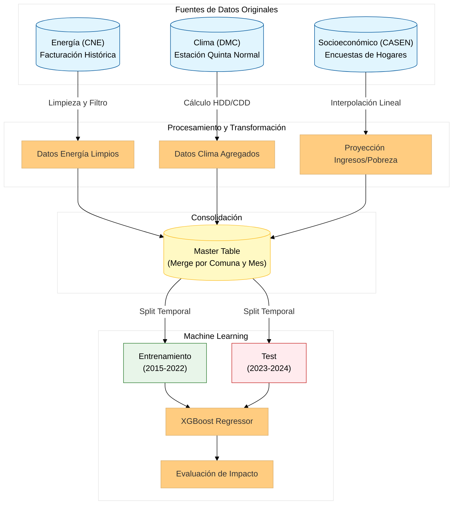
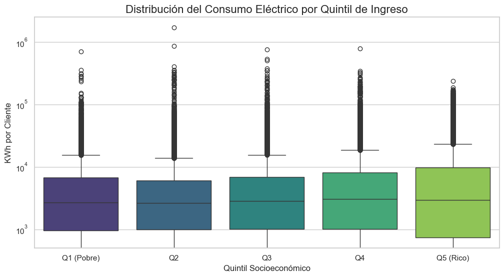
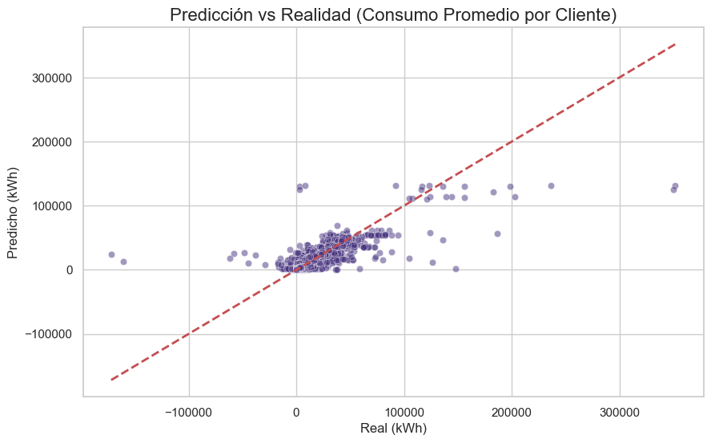

# Desigualdad Térmica y Eficiencia: Predicción del Consumo Eléctrico en la RM
### Un enfoque de Ciencia de Datos para la planificación energética territorial

**Autores:** Thomas Johnson, Bastián Pérez, Vicente Rodríguez.  
**Fecha:** Noviembre 2025

---

## 1. El Problema: La Raíz de la Demanda
**La Pregunta:** ¿Es posible reducir el consumo eléctrico residencial en un 5-10% en Santiago mediante datos, sin sacrificar el confort de los hogares vulnerables?

**La Realidad:** El consumo eléctrico en Santiago no es solo una función termodinámica; es un proxy de la desigualdad socioeconómica.
* **Ineficiencia:** La infraestructura habitacional deficiente obliga a un sobreconsumo para mantener el confort térmico.
* **Trampa del Frío:** Los sectores vulnerables no consumen poco por eficiencia, sino por restricción presupuestaria (Pobreza Energética).

---

## 2. Arquitectura de Datos (ETL)
Para aislar las variables críticas, construimos un pipeline unificado cruzando tres fuentes oficiales desconectadas:

1.  **Energía (CNE):** Facturación histórica mensual por comuna. Limpieza de outliers industriales y normalización geoespacial.
2.  **Clima (DMC - Quinta Normal):** Cálculo de **Grados-Día de Calefacción (HDD)** base 15°C para medir la demanda térmica real, superando el uso simplista de la temperatura promedio.
3.  **Socioeconómico (CASEN):** Interpolación lineal de ingresos y pobreza (2015-2025) para dar continuidad temporal a las encuestas bianuales.

---

## 3. Hallazgos del Análisis Exploratorio

### La Estacionalidad es Mandatoria
La curva de consumo presenta una forma de "U" perfecta. Los picos ocurren sistemáticamente en invierno (junio-agosto), correlacionados inversamente con la temperatura. **Conclusión:** La matriz residencial de la RM es dependiente de la calefacción.

### La Brecha de Ingresos (El hallazgo clave)
Al segmentar el consumo por nivel socioeconómico, la desigualdad se hace tangible:
* **Quintil 5 (Altos Ingresos):** Demanda elástica. Ante el frío, el consumo se dispara. Tienen los medios para climatizar.
* **Quintil 1 (Bajos Ingresos):** Demanda inelástica/rígida. Ante el frío, el consumo apenas varía. No es eficiencia, es incapacidad de gasto.

---

## 4. Modelado Predictivo: XGBoost

Entrenamos un modelo de regresión **XGBoost** respetando la causalidad temporal para evitar fugas de datos (Data Leakage).

**Configuración:**
* **Train:** 2015 - 2022
* **Test:** 2023 - 2024
* **Target:** Consumo promedio por cliente (kWh).

**Métricas de Desempeño:**
* **MAE (Error Medio Absoluto):** ~13.8 kWh por hogar.
* **Error Relativo:** ~6.6% respecto al consumo promedio.

**Impacto:** El modelo tiene la precisión suficiente para ser utilizado como herramienta de auditoría territorial por distribuidoras y el Estado.

---

## 5. Discusión y Ética

### ¿Es factible la meta del 5%?
Sí, y se puede superar. El análisis de residuos del modelo detectó un **"exceso de consumo"** acumulado de **4,610 GWh** en el periodo de prueba.
* **Acción:** Si se focalizan subsidios de aislación térmica (\"Recambio de la envolvente\") exclusivamente en las comunas con residuos positivos altos (ineficiencia detectada).
* **Resultado:** Reducción potencial del **20.20%** de la demanda agregada.

### Limitaciones y Riesgos Éticos
1.  **Falacia Ecológica:** Este modelo utiliza datos agregados a nivel comunal. **No debe utilizarse para juzgar o penalizar hogares individuales**. Un alto consumo comunal indica un problema de infraestructura, no un fallo moral de sus habitantes.
2.  **Proxy Climático:** Se asume homogeneidad climática en la RM. Esto subestima la demanda en zonas precordilleranas (Lo Barnechea) donde el frío es más intenso que en la estación de referencia (Quinta Normal).

---

## 6. Recursos del Proyecto

* **[Repositorio de Código (GitHub)](https://github.com/vtyphoonic/IMT2200-Proyecto)**: Acceso completo a los scripts de ETL y modelado.
* **[Notebook: Limpieza y EDA](./notebooks/04_Limpieza_y_EDA.ipynb)**: Profundización en las estadísticas descriptivas.
* **[Notebook: Modelado y Evaluación](./notebooks/05_Modelado_y_Evaluacion.ipynb)**: Detalles de la configuración del XGBoost y análisis de errores.

### Referencia Técnica
Para profundizar en la adaptación de algoritmos de boosting para series temporales:
[Video: XGBoost for Time Series Forecasting](https://www.youtube.com/watch?v=z3ZnOW-S550)
